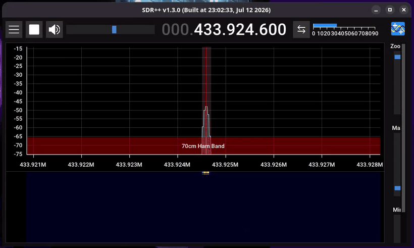
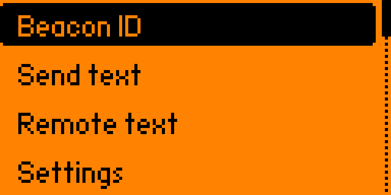
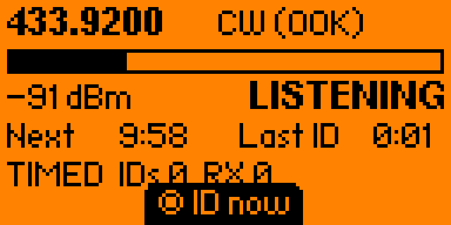
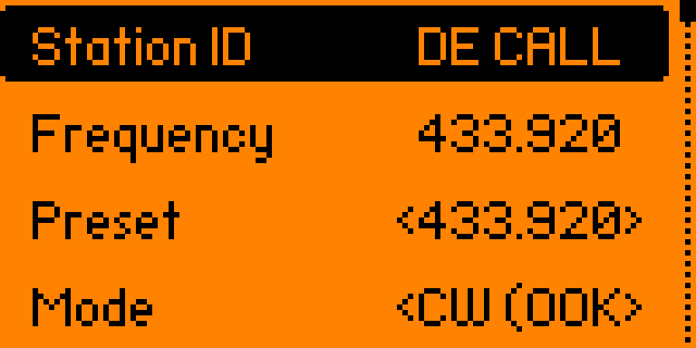
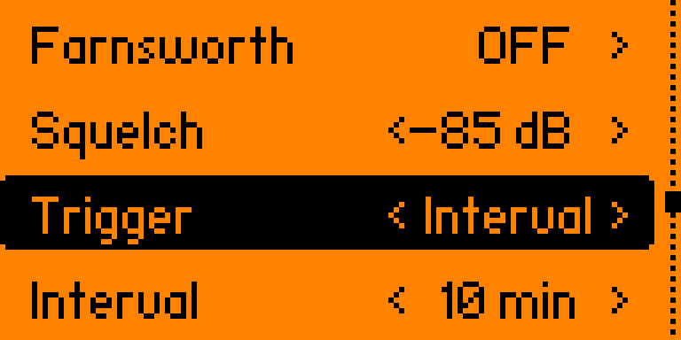
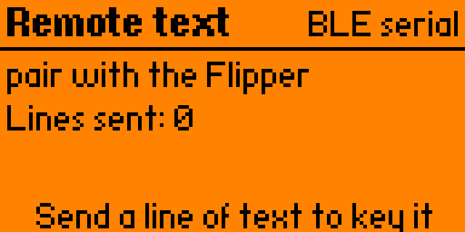
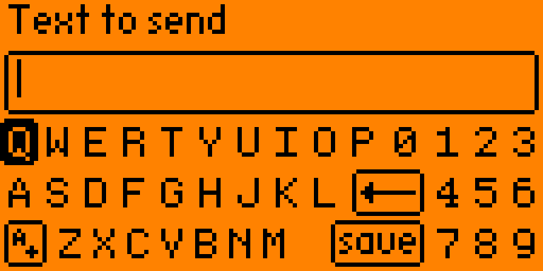
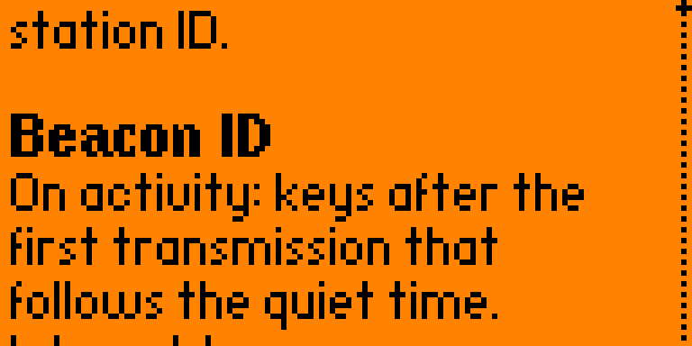

# Morse Beacon — sub-GHz CW / MCW station ID for Flipper Zero


[](https://github.com/jdmills-edu/flipper-morse-beacon/actions/workflows/build.yml)

A Flipper FAP that keys Morse code out of the CC1101. Two jobs:

1. **Beacon ID** — key your identifier automatically: either after the first
   transmission that follows a stretch of dead air (repeater-style), or on a
   fixed interval regardless of the channel (fox hunt or plain beacon).
2. **Remote text** — send arbitrary text as Morse, typed on the Flipper, or
   pushed from a phone over BLE / a device wired to pins 13/14.

Builds against the **official firmware SDK** and against the **Unleashed SDK**
(which is what RogueMaster reports too). A FAP only loads on a firmware whose
API version matches the SDK it was built with, so build against the SDK that
matches what your Flipper is running.

## On the air

The beacon keying its ID on 433.924 MHz, received on an RTL-SDR in SDR++
([webm](docs/sdr.webm)):



## Screens

Captured off the device over the RPC screen stream — these are real frames,
not mockups.

| Main menu | Beacon monitor |
|---|---|
|  |  |

| Settings | Trigger and interval |
|---|---|
|  |  |

| Remote text over BLE | Send text |
|---|---|
|  |  |

| Built-in manual |
|---|
|  |

## Build and install

```
pipx install ufbt

# Official firmware:
ufbt update --channel=release

# Unleashed / RogueMaster instead:
ufbt update --index-url=https://up.unleashedflip.com/directory.json --channel=release

cd flipper-morse
ufbt              # build -> dist/morse_beacon.fap
ufbt launch       # build, upload to /ext/apps/Sub-GHz/, and run
```

Which frequencies the firmware will actually transmit on is firmware
policy, not the app's: the official firmware enforces its region table, while
custom firmwares are typically wider. The app asks the firmware before keying
and reports a refusal in the log rather than working around it.

## How the signal is generated

Keying the carrier on and off — real CW — is silent on an FM receiver: the
squelch opens and closes, nothing else. For a GMRS or ham FM radio to hear a
tone, the tone has to ride on the carrier as modulation. The four modes cover
both cases.

**MCW (default).** The CC1101 is put in 2-FSK with the deviation set to ±2.38 kHz
(narrowband) or ±4.76 kHz (wideband), and the async-TX data line is square-waved
between the two tones at audio rate — 800 Hz by default. An FM discriminator
turns that back into an 800 Hz tone. During the spaces between dits and dahs the
line is held at one tone, so the carrier stays up and the audio goes quiet —
the same sound a hardware repeater's ID makes.

**CW (OOK).** The carrier itself is keyed on and off. This is real CW, and it is
what you want if something is listening with an AM/CW detector or a BFO — but on
an FM receiver it just opens and closes the squelch, with no tone.

**SSB (USB / LSB).** The same bare-carrier keying, but the carrier is offset
from the dial frequency by the Tone setting — above the dial for USB, below for
LSB. This is how a rig keys CW into an SSB passband: a receiver
sitting on the dial frequency in the matching sideband hears the beat note at
the tone pitch. The CC1101 synthesizer steps in ~397 Hz increments
(26 MHz / 2¹⁶), so the actual pitch lands on the nearest step — an 800 Hz
setting comes out near 794 Hz. Preamble/tail don't apply (there is no carrier
to hold up between elements), and the RX side still parks on the dial
frequency, since the offset is far inside even the narrowest channel filter.

The deviation values come from patching `DEVIATN` in a custom CC1101 preset
built at runtime from the stock 2-FSK register table (`0x04` → 2.38 kHz,
`0x14` → 4.76 kHz). The same preset narrows the RX channel filter (`MDMCFG4`)
from the stock 270 kHz down to 101 kHz by default and drops the IF to 152 kHz
(`FSCTRL1`), so the squelch hears the channel rather than half the band.

Timing is PARIS-standard: dit = 1200/wpm ms. Verified on the host — five
`PARIS` at 20 wpm renders 14.580 s of segments, which is exactly 243 dit units,
and 15.000 s once you add the trailing word space. Farnsworth spacing uses the
ARRL formula (`ta = (60c − 37.2s)/cs`, split 3/19 and 7/19), so 20 wpm characters
at 10 wpm overall lands on 30.000 s per five words.

## Beacon triggers

`Trigger` selects when the ID goes out:

| Trigger | Behaviour |
|---|---|
| `On activity` | ID after the first transmission that follows `Quiet time` of dead air. Silent on a dead channel. |
| `Interval` | ID every `Interval`, whether or not anyone is on the channel. For a fox or a plain beacon. |
| `Both` | Whichever comes first. |

`Interval` runs 15 s to 30 min. **`Measure from` decides what the period is
measured between:**

| `Measure from` | Meaning |
|---|---|
| `Start of TX` (default) | Transmissions begin at fixed multiples of the period. The cadence is the period, exactly. |
| `End of TX` | The period is the gap of dead air between one ID ending and the next starting. The cycle is then period + however long the ID takes. |

`End of TX` was the original behaviour and is still the right choice if what you
care about is guaranteeing a minimum quiet gap for other users. But it folds the
length of every transmission into the cycle: measured on air with a 15 s interval
and a 6.84 s ID, the cadence came out at 22.65 s (15 + 6.84 + ~0.8 s of retune
and preset reload). For a fox that has to be found on a schedule, that is the
wrong knob.

`Start of TX` schedules against an absolute deadline and advances it by whole
periods, so quantisation never accumulates — a 60 s interval stays on 60 s
indefinitely rather than walking.

**If the identifier is longer than the interval** there is no honest way to keep
transmissions one period apart without keying continuously. Whole slots are
dropped instead and the overrun is written to the log:

```
beacon: ID longer than the interval, skipped 1 slot(s)
```

`Quiet time`, `Max ID gap` and `Courtesy` apply only to the activity rule, and
are hidden in `Interval` mode.

## Activity trigger logic

This is the `On activity` rule — repeater-controller behaviour. The controller
polls RSSI every 20 ms and runs this state machine:

```
LISTENING ──carrier > squelch for min_carrier_ms──> BUSY
BUSY ──carrier gone for hang_ms──> was the channel quiet long enough
                                    before this transmission started?
                                    ├── yes ──> PENDING
                                    └── no  ──> LISTENING
PENDING ──channel still clear after courtesy_delay──> key the ID
        └──traffic returns──> back to BUSY, ID still owed
```

So the ID goes out **at the end of the first transmission that follows the
configured quiet time**, not in the middle of someone's over. `Max ID gap` is a
backstop: if the channel has been busy continuously and that much time has
passed since the last ID, the next transmission end triggers one anyway.

`OK` on the beacon screen keys an ID immediately.

## Settings

| Setting | Notes |
|---|---|
| Station ID | The text to send. `DE CALLSIGN` placeholder — change it. |
| Frequency | Entered in 100 Hz steps over whatever the firmware can tune. Defaults to 433.920. |
| Preset | GMRS 1–7 and 15–22, plus 315.000, 432.300, 433.920, 446.000, 915.000. Shows `Custom` when the frequency is not one of them. |
| Mode | MCW (FM), CW (OOK), SSB (USB) or SSB (LSB). |
| Deviation | 2.4 kHz (12.5 kHz channels) or 4.8 kHz (25 kHz channels). |
| RX filter | 58 / 101 / 135 / 270 kHz. Narrower = better squelch. |
| Tone | 400–1200 Hz. |
| Speed / Farnsworth | Character speed and optional stretched spacing. |
| Squelch | −110 to −50 dBm. Tune this against the live channel. |
| Trigger | On activity / Interval / Both — see above. |
| Interval | 15 s–30 min. Interval-mode period. |
| Measure from | `Start of TX` or `End of TX` — see above. Interval modes only. |
| Quiet time | Dead air needed before the next transmission triggers an ID (activity rule only). |
| Max ID gap | Backstop interval, or OFF. |
| Courtesy | Delay after the channel clears before keying. |
| Preamble / Tail | Dead carrier before and after the message (MCW only). |
| Radio | Internal CC1101 or an attached external module. |
| Remote | BLE or UART for the remote-text screen. |
| ID on start | Off by default, so entering beacon mode does not immediately key. |

### Rows appear only when they apply

The list is built from the current configuration rather than being fixed, so it
only ever shows rows that would change what the beacon does:

| Hidden when | Rows |
|---|---|
| Mode is `CW (OOK)` | `Deviation`, `Tone`, `Preamble`, `Tail` — CW keys the bare carrier, so there is no tone to pitch and no carrier for an unkeyed preamble to hold up |
| Mode is `SSB` | `Deviation`, `Preamble`, `Tail` — bare carrier like CW, but `Tone` stays: it sets the carrier's offset from the dial, which is the received pitch |
| Trigger is `Interval` | `Quiet time`, `Max ID gap`, `Courtesy` — the whole activity state machine is out of circuit |
| Trigger is `On activity` | `Interval`, `Measure from` |
| Remote is not `UART` | `UART baud` |

`Squelch` and `RX filter` deliberately stay visible in every mode. Nothing keys
off them in `Interval` mode, but they still drive the carrier indicator on the
beacon screen, which is worth being able to set.

Settings persist to `/ext/apps_data/morse_beacon/beacon.conf`.

## Remote text

`Remote text` on the main menu starts the link and keys every complete line it
receives.

- **BLE** — the app takes over the Flipper's BLE serial service and advertises
  under the Flipper's own name. Connect with nRF Connect or any BLE terminal:

  | | |
  |---|---|
  | service | `8fe5b3d5-2e7f-4a98-2a48-7acc60fe0000` |
  | write here | `19ed82ae-ed21-4c9d-4145-228e62fe0000` (write request or command; both work) |
  | subscribe here | `19ed82ae-ed21-4c9d-4145-228e61fe0000` — *indications*, for the `ok` / `err:` replies |

  The write characteristic carries `ATTR_PERMISSION_AUTHEN_WRITE`, so the link
  must be bonded — an unpaired write fails with insufficient authentication
  rather than doing nothing visible. While this screen is open the official
  Flipper mobile app cannot connect; the profile is restored when you back out.
- **UART** — pins 13 (TX) / 14 (RX), 8N1, baud rate configurable. For an ESP32,
  a keyboard bridge, or anything else that can emit a line of text.

A line ends at a newline **or** after a ~400 ms pause, because BLE terminals
send a message as one packet with no line ending. Lines are capped at 64
characters and the queue holds 4; if you push text faster than the key can send
it, the oldest line is dropped.

## Frequency range

This app imposes **no region policy**. It never consults a region table; the
firmware alone decides what may be transmitted. The only check here is whether
the radio can be tuned at all:

    281-361, 378-481, 749-962 MHz

which mirrors `furi_hal_subghz_is_frequency_valid()` — the hardware tuning
span, identical across firmwares. Before keying, the app asks the firmware's
own policy check (`furi_hal_region_is_frequency_allowed()`, present in both the
official and Unleashed SDKs): the official firmware answers from its
provisioned region table, while Unleashed/RogueMaster carry no country table
and default to 300-350, 387-467.75 and 779-928 MHz, widened to the full range
above by their extended-range setting. If the firmware refuses a transmission
the reason is logged rather than silently swallowed.

The check is duplicated here deliberately: `subghz_devices_is_frequency_valid()`
**cannot be used as a test** on the internal radio, because its implementation
calls `furi_crash()` on an out-of-range frequency instead of returning false.
Asking it about a frequency in one of the gaps reboots the device.

## Frequency presets

GMRS **15–22** (462.5500–462.7250) are the main high-power channels and the
repeater outputs RP15–RP22 — where a repeater's own ID is transmitted, which is
what this app was originally for. GMRS **1–7** (462.5625–462.7125) are the
interstitial simplex channels.

Outside GMRS:

| Preset | What it is |
|---|---|
| 315.000 | US ISM, a common Part 15 remote frequency. Bench testing. |
| 432.300 | Start of the 70 cm propagation-beacon subband (432.300–432.400, ARRL plan) — the one segment on 70 cm actually set aside for beacons. |
| 433.920 | ISM, and the frequency the Flipper's antenna is matched for. Busy with Part 15 traffic. |
| 446.000 | 70 cm national FM simplex **calling** frequency. A landmark for finding your way around the band — not somewhere to park a beacon. |
| 915.000 | US ISM centre. Bench testing. |

Band plans are voluntary and regional; coordinate locally before running a fox.

Channels **8–14** are deliberately absent: they sit at 467.5625–467.7125 MHz,
outside the band the CC1101 is rated for. The 467 MHz repeater *inputs* are
missing for the same reason, so this cannot key a repeater through its input —
only transmit on its output.

## Limits

- The CC1101 is rated **300-348, 387-464 and 779-928 MHz**. Unleashed raises the
  default TX ceiling to 467.75 MHz, so GMRS repeater *inputs* at 467 MHz are
  within what the firmware allows — but they are outside the chip's rated band
  and the Flipper's RF matching is tuned for 433, so output power and spurious
  performance there are unspecified.
- Output is roughly **10 mW** into an antenna that is matched for 433 MHz, so
  462 MHz range is short.
- There is **no CTCSS/DCS**. Binary FSK can only sit on one of two frequencies at
  a time, so a sub-audible tone cannot be summed with the audio tone. Generating
  arbitrary audio would need duty-cycle dithering at ~100 kHz in the TX ISR —
  possible in principle, not implemented.
- `Send text` and `Remote text` key immediately without checking whether the
  channel is busy. Only the beacon mode listens first.
- A Flipper is not FCC type-accepted for Part 95 (GMRS). Under Part 97, a
  licensed amateur may use homebrew equipment. Transmit only where you are
  licensed to.

## Layout

```
morse.c/h    Morse table, PARIS + Farnsworth timing, text -> timed segments
radio.c/h    CC1101 ownership: custom presets, async-TX ISR generator, RSSI
beacon.c/h   channel-watching state machine, ID trigger rules, interval schedule
link.c/h     BLE serial / UART line receiver with a worker thread
config.c/h   settings struct, defaults, validation, persistence
idlog.c/h    timestamped station log
morse_beacon.c   views, menus, conditional settings list, navigation
tools/       host-side: off-air capture and decode (Python), sched_test.c
```

Sources are listed explicitly in `application.fam` rather than globbed — ufbt's
default `*.c*` pattern is recursive and would otherwise sweep `tools/sched_test.c`
into the firmware build.

## Logging

Every ID and every radio error appends a timestamped line to
`/ext/apps_data/morse_beacon/id_log.txt` — both a station ID record and the only
way to see what the radio did when nobody is watching the screen:

```
2026-09-08 13:25:11 ui: entering beacon, 433920000 Hz
2026-09-08 13:25:11 listen: asked 433920000 Hz, tuned 433919830 Hz
2026-09-08 13:26:11 id: keying "DE CALLSIGN"
2026-09-08 13:26:18 send: 433920000 Hz MCW 57 seg, 6833 ms planned, 6840 ms actual
```

The worker start line also records the trigger and, in the interval modes, which
end of the transmission the period is measured from:

```
beacon: worker start, 433920000 Hz, trigger=interval, start-to-start
```

and an identifier that will not fit inside the interval is reported rather than
silently keying continuously:

```
beacon: ID longer than the interval, skipped 1 slot(s)
```

At 256 KB the file is rotated to `id_log.old.txt` (replacing the previous one),
so the log never holds more than 512 KB total.
